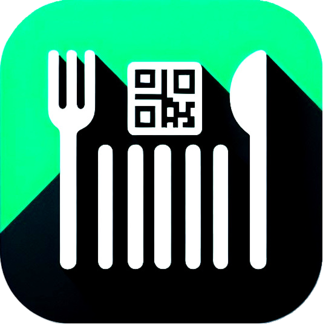

# SafeEats



SafeEats is a comprehensive mobile application designed to help users manage food restrictions and make informed decisions about food products through barcode scanning. Whether you're dealing with allergies, dietary restrictions, or specific food preferences, SafeEats helps ensure your food choices align with your needs.

## Features

### Multiple Profiles
- Create and manage multiple restriction profiles
- Perfect for families or individuals with different dietary needs
- Easy profile switching
- Each profile maintains its own set of restrictions

### Smart Restriction Management
- **Categorized Restrictions:**
  - Allergens (e.g., peanuts, dairy, gluten)
  - Dietary (e.g., vegetarian, vegan)
  - Religious (e.g., halal, kosher)
  - Medical (e.g., low sodium, sugar-free)
  - Custom categories (Not Working)
- **Severity Levels:**
  - High: Strict avoidance required
  - Medium: Moderate concern
  - Low: Preference
- Pre-configured common restrictions
- Custom restriction support

### Advanced Product Scanning
- Fast and accurate barcode scanning
- Manual barcode entry option
- Comprehensive product information:
  - Product name and brand
  - Complete ingredient list
  - Allergen warnings
  - Nutritional information
  - Product images

### Intelligent Safety Analysis
- Real-time safety checking against active profile
- Clear safety indicators
- Detailed ingredient analysis
- "May contain" warnings for high-severity restrictions
- Category-based organization of detected restrictions

### User-Friendly Interface
- Clean, modern design
- Intuitive navigation
- Clear visual safety indicators
- Easy profile management
- Organized restriction categories

## Installation

### Prerequisites
- Android 5.0 (API level 21) or higher
- iOS 11.0 or higher
- 100 MB of free storage space

### Download Options
- [Direct APK Download](https://github.com/0v3rr1de0/SafeEats/releases/latest)

### Manual Installation (Development)
1. Ensure Flutter is installed and configured:
   ```bash
   flutter doctor
   ```

2. Clone the repository:
   ```bash
   git clone https://github.com/0v3rr1de0/SafeEats.git
   ```

3. Install dependencies:
   ```bash
   cd SafeEats
   flutter pub get
   ```

4. Run the app:
   ```bash
   flutter run
   ```

## Usage Guide

### Setting Up Profiles
1. Launch SafeEats
2. Navigate to the Profiles tab
3. Tap "Add Profile" to create a new profile
4. Name your profile (e.g., "John's Allergies")
5. Add restrictions from common templates or create custom ones
6. Set severity levels and categories for each restriction

### Scanning Products
1. Point your camera at a product's barcode
2. Hold steady until the barcode is recognized
3. View the comprehensive safety analysis
4. Check detailed product information and warnings

### Managing Restrictions
1. Go to the Restrictions tab
2. Select a profile to modify
3. Add new restrictions:
   - Choose from common templates
   - Create custom restrictions
4. Set severity levels and categories
5. Remove or modify existing restrictions

### Switching Profiles
1. Open the Restrictions tab
2. View all available profiles
3. Tap "Set Active" on the desired profile
4. Confirm the switch

## Development

### Tech Stack
- Flutter Framework
- Dart Programming Language
- OpenFoodFacts API
- SQLite Database
- SharedPreferences for local storage

### Project Structure
```
lib/
├── models/          # Data models
├── screens/         # UI screens
├── services/        # Business logic
├── widgets/         # Reusable components
└── main.dart        # App entry point
```

### Contributing
1. Fork the repository
2. Create a feature branch
3. Commit your changes
4. Push to the branch
5. Create a Pull Request

## License

This work is licensed under a [Creative Commons Attribution-NonCommercial-ShareAlike 4.0 International License][cc-by-nc-sa].

[![CC BY-NC-SA 4.0][cc-by-nc-sa-image]][cc-by-nc-sa]

[cc-by-nc-sa]: http://creativecommons.org/licenses/by-nc-sa/4.0/
[cc-by-nc-sa-image]: https://licensebuttons.net/l/by-nc-sa/4.0/88x31.png
[cc-by-nc-sa-shield]: https://img.shields.io/badge/License-CC%20BY--NC--SA%204.0-lightgrey.svg

## Support

For support, feature requests, or bug reports:
- Create an issue on GitHub
- Email: support@netique.lol (Coming soon)
- Visit: [eats.netique.lol](https://eats.netique.lol)

## Acknowledgments

- OpenFoodFacts for their comprehensive food database
- Flutter team for the amazing framework
- All contributors and testers

---

Made with ❤️ for food safety
